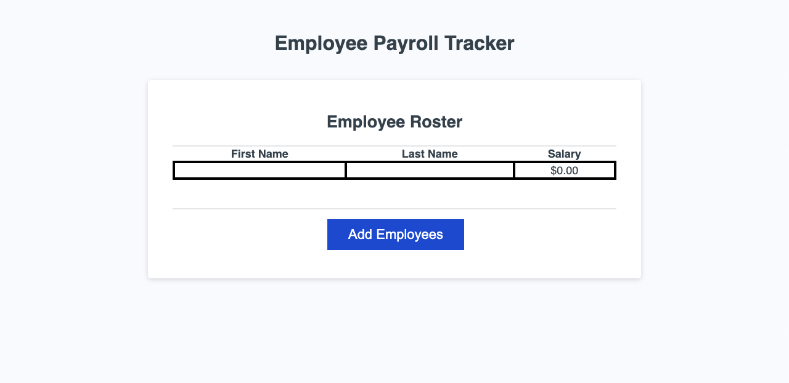
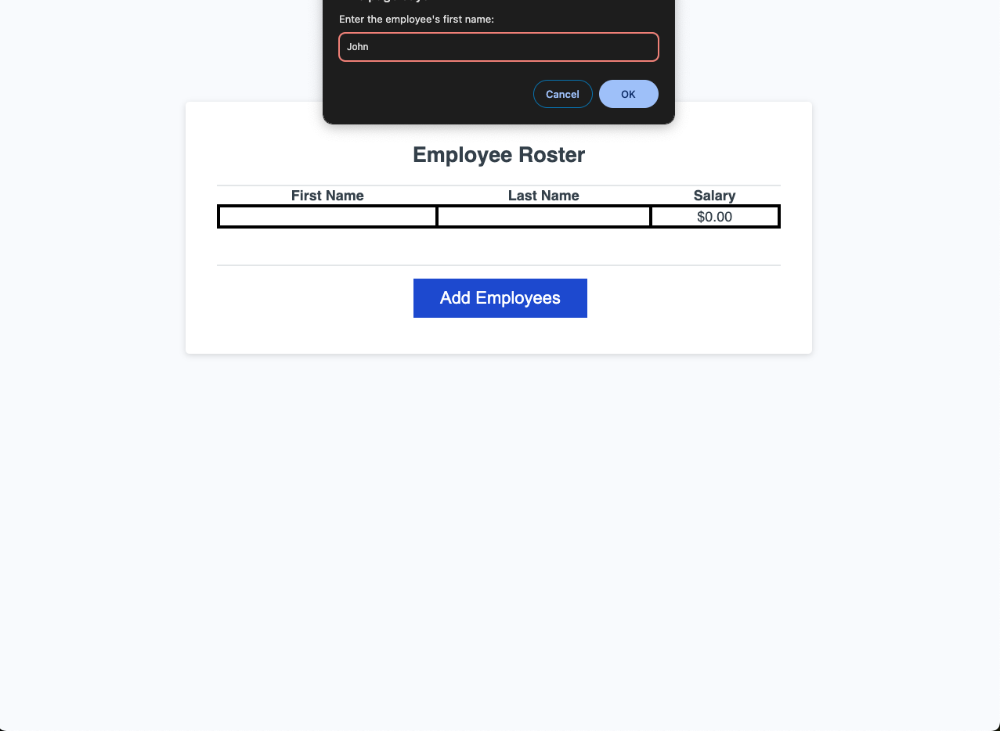
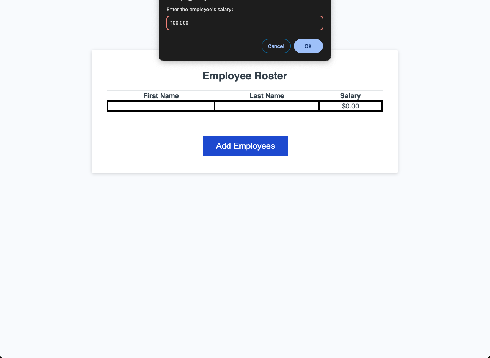
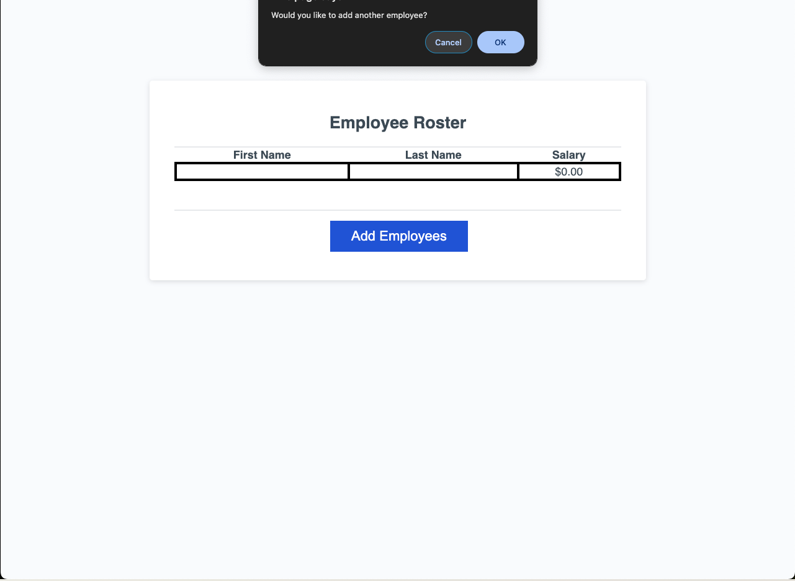
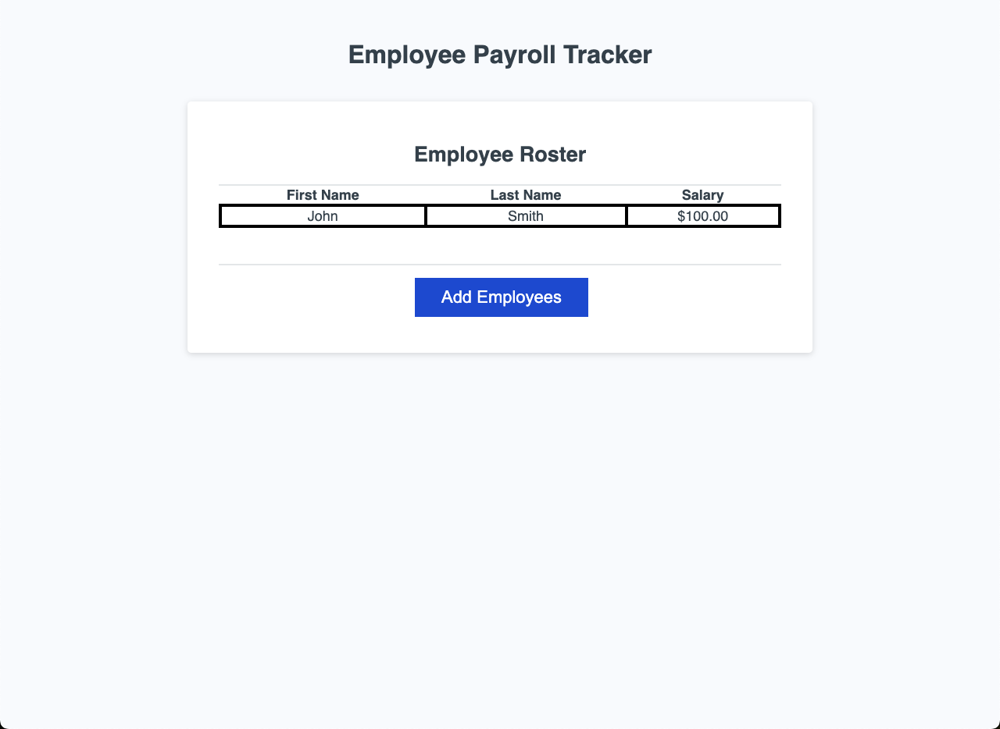
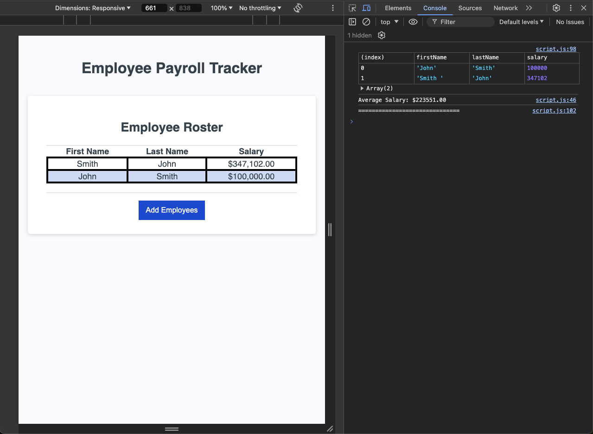
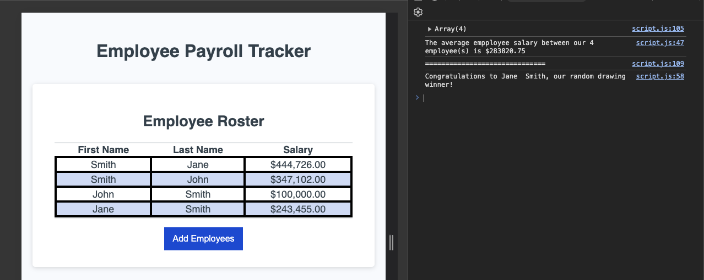
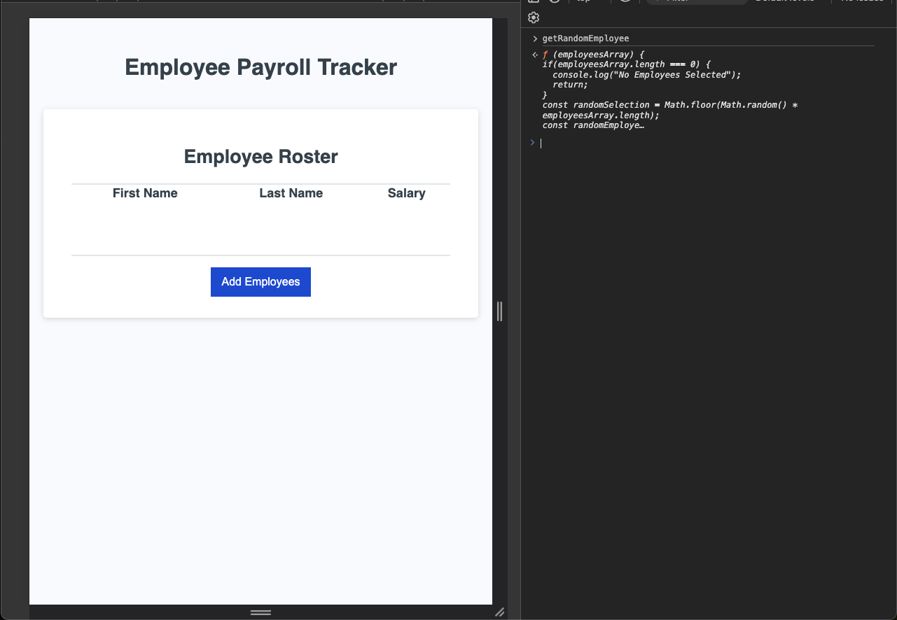

# employee-payroll-tracker
Module 3 Challenge

## Table of Contents
* [Description](#Description) 
* [Installation](#installation)
* [Usage](#usage)
* [Features](#features-added)
* [Screenshots](#screenshots)
* [Contributing](#contributing)
* [Contact](#contact)
* [Links](#links)

## Description 

The Employee Payroll Tracker is a web application designed to help payroll managers view and manage employee payroll data. 

My task was to create 3 major upgrades to the application:

1. Collect employees:
* First  name 
* Last name
* Salary

2. Display their Average Salary

3. Random Pick a Employee

This application __**NOW**__ allows users to add employees, view information, calculate the average salary, and randomly select an employee for reward.

## Installation 

- Clone: git clone git@github.com:johnwgomez/employee-payroll-tracker.git
- cd employee-payroll-tracker
- Open the index.html file in your preferred web browser

## Usage

1. Open the index.html file in your web browser
2. Click on the “Add Employees” button.
3. Follow the prompts to enter employee details such as first name, last name, and salary
4. After adding employees, the application will:
    * Display the employee data in a table
    * Calculate the average salary
    * Randomly select an employee for recognition

## Features Added

### collectEmployees
* Add employees with their first name, last name, and salary
* View the employee roster in a tabular format

#### Helpful Links
[isNAN and how to use it](https://www.w3schools.com/jsref/jsref_isnan.asp)

### displayAverageSalary
* 	Calculate and display the average salary of all employees

### getRandomEmployee
* Randomly select an employee for rewards or recognition

#### Helpful Links
[math.random and how to use it](https://developer.mozilla.org/en-US/docs/Web/JavaScript/Reference/Global_Objects/Math/random)

## Screenshots 

### collectEmployees

### displayAverageSalary

### No Employees Selected

## Contributing

Contributions are welcome! Please follow these steps to contribute:
1. Fork the repository.
2. Create a new branch (git checkout -b feature-branch).
3. Make your changes.
4. Commit your changes (git commit -m 'Add some feature').
5. Push to the branch (git push origin feature-branch).
6. Open a pull request.

## Contact
johngomez@email.com

## Links
